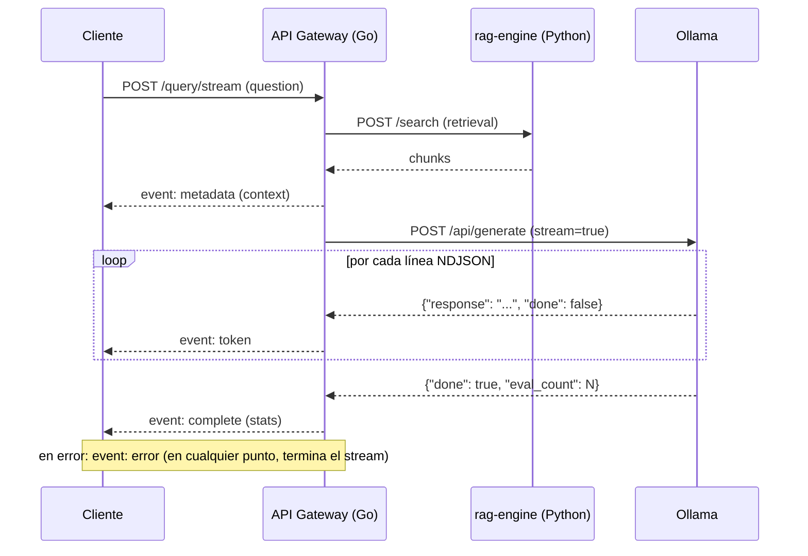

# 🚀 Go API Gateway — RAG System

Un API Gateway resiliente y concurrente desarrollado en **Go**, diseñado bajo los principios de **Clean Architecture** y **SOLID**. Actúa como el punto de entrada orquestador entre los clientes externos, el motor de búsqueda vectorial (**rag-engine** en Python) y el LLM (**Ollama**).

---

## 🏗️ Arquitectura y Diseño

El proyecto sigue una arquitectura hexagonal o **Clean Architecture** dividida en capas concéntricas, garantizando la inversión de dependencias y el desacoplamiento total de frameworks o infraestructura externa.

```text
api-go/
├── cmd/
│   └── api/
│       └── main.go                  # Composition Root & Inyección de Dependencias
└── internal/
    ├── core/                        # NÚCLEO DEL NEGOCIO (Sin dependencias externas)
    │   ├── domain/                  # Entidades puras y errores de negocio
    │   │   └── query.go
    │   ├── ports/                   # Contratos / Interfaces (DIP)
    │   │   ├── rag_port.go
    │   │   ├── llm_port.go
    │   │   └── query_service.go
    │   └── services/                # Casos de uso / Orquestación
    │       └── query_orchestrator.go
    └── adapters/                    # INFRAESTRUCTURA Y DETALLES
        ├── http/                    # Enrutamiento, Handlers y Middlewares
        │   ├── handlers/
        │   ├── middlewares/
        │   └── router.go
        ├── clients/                 # Adaptadores de salida (Python / Ollama)
        └── decorators/              # Decoradores para concurrencia (Worker Pool)
```

## 🧩 Principios SOLID y Patrones Aplicados

### Single Responsibility Principle (SRP)

Cada paquete tiene una responsabilidad acotada:

- `QueryHandler` gestiona el protocolo HTTP.
- `WorkerPoolUseCaseDecorator` maneja los límites de recursos.
- `QueryOrchestrator` contiene la lógica de negocio y orquestación de consultas.

### Dependency Inversion Principle (DIP)

El núcleo (`core`) no depende de implementaciones concretas. Define contratos en `ports/` que son implementados por la capa `adapters/`.

### Open/Closed Principle (OCP) y Patrón Decorator

La limitación de concurrencia se implementa envolviendo el caso de uso principal mediante `WorkerPoolUseCaseDecorator`, sin modificar el código del orquestador.

### Graceful Degradation & Protection

Diseñado para ejecutarse de forma segura en entornos con recursos limitados de CPU y memoria.

---

## ⚡ Concurrencia y Control de Recursos

### Worker Pool (Semáforo mediante canales)

Limita las peticiones concurrentes utilizando un canal con búfer para evitar sobrecargas de RAM y CPU causadas por consultas simultáneas hacia Ollama.

### Rate limiting por IP y usuario

Las rutas `POST /api/v1/query` y `POST /query/stream` aplican dos límites independientes por ventana fija: uno por IP de origen y otro por usuario autenticado. Una petición que supera cualquiera de los límites recibe `429 Too Many Requests` y `Retry-After`. El límite es local a cada instancia del gateway y no reemplaza un rate limiter distribuido si se escala horizontalmente.

Variables: `RATE_LIMIT_ENABLED` (por defecto `true`), `RATE_LIMIT_REQUESTS` (por defecto `60`) y `RATE_LIMIT_WINDOW` (por defecto `1m`). El worker pool (`WORKER_LIMIT`) sigue siendo el límite global de concurrencia y puede responder con saturación aunque el rate limit no se haya alcanzado.

### Context Cancellation & Timeout Middleware

Toda petición HTTP propaga un `context.Context` con un límite configurable de **5 minutos** por defecto.

Si el cliente cancela la solicitud o expira el tiempo establecido:

- Los sockets HTTP se cierran inmediatamente.
- Se interrumpen las operaciones pendientes.
- Se evitan fugas de memoria (*goroutine leaks*).

### Reutilización de HTTP Client

Instancia única de `http.Client` con soporte para:

- Keep-Alive.
- Reutilización de conexiones TCP.
- Menor latencia y consumo de recursos.

---

## 🔌 Endpoints

### POST `/api/v1/query`

Procesa la pregunta del usuario, recupera contexto desde `rag-engine` y genera una respuesta utilizando Ollama.

#### Request Body

```json
{
  "question": "¿Cómo se realiza el mantenimiento del sistema de lubricación?",
  "document_id": "0-lubricacion-mantenimiento",
  "chapter": "2",
  "section": "2.1"
}
```

Los campos `document_id`, `chapter` y `section` son opcionales y se combinan con AND cuando se envían.

#### Response Body (200 OK)

```json
{
  "question": "¿Cómo se realiza el mantenimiento del sistema de lubricación?",
  "answer": "El mantenimiento requiere revisar los niveles de aceite...",
  "context": [
    {
      "text": "Fragmento de texto recuperado del manual...",
      "score": 0.89,
      "metadata": {}
    }
  ]
}
```

---

### POST `/query/stream` — Streaming en tiempo real (SSE)

Misma lógica que `/api/v1/query` (retrieval + generación) pero reenvía la respuesta de Ollama token por token mediante **Server-Sent Events**, sin reconstruir la respuesta completa en el Gateway. Requiere el mismo `Bearer <access_token>` que `/api/v1/query`.



#### Request Body

Igual que `/api/v1/query`:

```json
{
  "question": "¿Cómo se realiza el mantenimiento del sistema de lubricación?"
}
```

#### Eventos SSE

El cuerpo de la respuesta usa `Content-Type: text/event-stream`. Cada evento sigue el formato `event: <tipo>\ndata: <json>\n\n`:

| Evento | Cuándo se emite | Payload |
|---|---|---|
| `metadata` | Una vez, tras el retrieval, antes de generar | `{"context": [{"text": "...", "score": 0.89, "metadata": {}}]}` |
| `token` | Una vez por fragmento de texto recibido de Ollama | `{"text": "fragmento"}` |
| `complete` | Una vez, al finalizar correctamente | `{"total_duration_ms": 1234, "time_to_first_token_ms": 210, "token_count": 42}` |
| `error` | En cualquier fallo (retrieval, generación, sobrecarga); termina el stream | `{"error": "mensaje"}` |

Ejemplo de flujo:

```text
event: metadata
data: {"context":[{"text":"...","score":0.89,"metadata":{}}]}

event: token
data: {"text":"El "}

event: token
data: {"text":"mantenimiento "}

event: complete
data: {"total_duration_ms":1834,"time_to_first_token_ms":210,"token_count":42}
```

#### Ejemplo con `curl`

```bash
curl -N --no-buffer -X POST http://localhost:8080/query/stream \
  -H "Authorization: Bearer <access_token>" \
  -H "Content-Type: application/json" \
  -d '{"question": "¿Cómo se realiza el mantenimiento del sistema de lubricación?"}'
```

`-N`/`--no-buffer` es necesario para ver los eventos a medida que llegan en vez de al final.

#### Ejemplo de consumo desde JavaScript

El endpoint no usa `EventSource` nativo (requiere `GET` sin headers personalizados); se consume con `fetch` y un `ReadableStream`:

```javascript
const response = await fetch("http://localhost:8080/query/stream", {
  method: "POST",
  headers: {
    Authorization: `Bearer ${accessToken}`,
    "Content-Type": "application/json",
  },
  body: JSON.stringify({ question: "¿Cómo se realiza el mantenimiento...?" }),
});

const reader = response.body.getReader();
const decoder = new TextDecoder();
let buffer = "";

while (true) {
  const { value, done } = await reader.read();
  if (done) break;
  buffer += decoder.decode(value, { stream: true });

  let frame;
  while ((frame = buffer.indexOf("\n\n")) !== -1) {
    const rawEvent = buffer.slice(0, frame);
    buffer = buffer.slice(frame + 2);
    const [eventLine, dataLine] = rawEvent.split("\n");
    const eventType = eventLine.replace("event: ", "");
    const payload = JSON.parse(dataLine.replace("data: ", ""));
    console.log(eventType, payload); // "metadata" | "token" | "complete" | "error"
  }
}
```

#### Cancelación, timeout y backpressure

- **Cancelación**: si el cliente cierra la conexión (p. ej. `AbortController.abort()`, cerrar la pestaña), `net/http` cancela automáticamente el `context.Context` de la petición; la siguiente escritura hacia Ollama o hacia el cliente falla y el stream se detiene sin fugas de goroutines ni de slots del worker pool.
- **Timeout**: `REQUEST_TIMEOUT` (por defecto `5m`) y `HTTP_CLIENT_TIMEOUT` acotan la duración total del stream igual que en `/api/v1/query`; si expiran a mitad de la generación, se emite `event: error` y la conexión se cierra.
- **Backpressure**: el Gateway no acumula la respuesta en memoria — cada token se escribe y se hace *flush* inmediatamente; si el cliente lee más lento de lo que Ollama genera, la propia escritura HTTP se bloquea (backpressure a nivel de TCP), frenando naturalmente la lectura desde Ollama.
- **Errores**: dado que las cabeceras HTTP ya se confirmaron en `200 OK` al emitir el primer evento, los errores posteriores al inicio del stream se comunican únicamente mediante `event: error`, nunca como un código de estado HTTP distinto. Errores previos al primer evento (JSON inválido, `rag-engine` caído antes de generar) sí devuelven un código HTTP de error normal.

#### Métricas relevantes

- `api_go_time_to_first_token_seconds`: latencia real hasta el primer token (antes idéntica a `api_go_generation_duration_seconds` porque no había streaming).
- `api_go_generation_duration_seconds`: duración total de la generación en Ollama.
- `api_go_http_request_duration_seconds`: duración total de la petición HTTP, incluye todo el streaming.
- `api_go_worker_pool_in_flight` / `api_go_worker_pool_rejections_total`: el pool de workers se comparte con `/api/v1/query`; una petición en streaming ocupa un slot durante toda la duración del stream.

---


Endpoint de verificación de estado destinado a Docker y orquestadores.

#### Response Body (200 OK)

```json
{
  "status": "UP"
}
```

### GET `/ready`

Comprueba que `rag-engine` y Ollama están disponibles para atender consultas. Devuelve `503` si alguna dependencia no está lista.

### GET `/metrics`

Expone métricas Prometheus del gateway: peticiones, latencias, errores, autenticación, dependencias, generación y concurrencia.

## Autenticacion y autorizacion

El API Gateway centraliza la autenticacion de usuario. `rag-engine` no recibe ni valida credenciales finales.

### Variables requeridas

Configura estas variables en el entorno del contenedor `api-go` o en un archivo `.env` local que no se versiona:

| Variable | Descripcion |
|---|---|
| `AUTH_JWT_SECRET` | Secreto HS256 del access token, minimo 32 caracteres |
| `AUTH_REFRESH_SECRET` | Secreto HS256 separado para refresh tokens, minimo 32 caracteres |
| `AUTH_ADMIN_USERNAME` | Usuario inicial configurado en el gateway |
| `AUTH_ADMIN_PASSWORD_HASH` | Hash bcrypt del password del usuario inicial |
| `AUTH_ADMIN_ROLES` | Roles separados por coma: `admin`, `operator`, `user` |

Opcionales: `AUTH_ISSUER`, `AUTH_AUDIENCE`, `AUTH_ACCESS_TTL` (por defecto `15m`), `AUTH_REFRESH_TTL` (por defecto `168h`), `OLLAMA_MODEL`, `WORKER_LIMIT`, `RATE_LIMIT_ENABLED`, `RATE_LIMIT_REQUESTS`, `RATE_LIMIT_WINDOW`, `HTTP_CLIENT_TIMEOUT` y `REQUEST_TIMEOUT` (por defecto `5m`) y `READINESS_INTERVAL` (por defecto `15s`).

Genera el hash con una herramienta bcrypt confiable, por ejemplo `htpasswd -bnBC 12 "" "tu-password"` y conserva solo el valor despues de los dos puntos. Nunca guardes el password ni los secretos en Git.

### Login

```http
POST /api/v1/auth/login
Content-Type: application/json

{"username":"admin","password":"tu-password"}
```

La respuesta contiene `access_token`, `refresh_token`, `token_type` y sus fechas de expiracion.

### Refresh

```http
POST /api/v1/auth/refresh
Content-Type: application/json

{"refresh_token":"..."}
```

Los refresh tokens son JWT stateless y expiran; no existe revocacion persistente hasta incorporar un almacen de sesiones o una lista de revocacion.

### Consulta protegida

```http
POST /api/v1/query
Authorization: Bearer <access_token>
Content-Type: application/json
```

Los roles `admin`, `operator` y `user` pueden consultar. La ausencia de token devuelve `401`; un token valido sin rol permitido devuelve `403`.

## Observabilidad

El gateway genera logs JSON y trazas OpenTelemetry OTLP. El trace context W3C se propaga hacia `rag-engine` y Ollama. Los rechazos por límite generan el evento `rate_limit_rejected` con alcance (`ip` o `user`) y ruta, sin etiquetas Prometheus de alta cardinalidad ni datos de autenticación. El stack completo está documentado en [`observability/README.md`](../observability/README.md).

## Compilacion y ejecucion

Requisitos: Docker y Docker Compose.

### Ejecutar con Docker Compose

Desde la raíz del proyecto:

```bash
docker compose --env-file .env.local up -d --build api-go
```

### Probar compilación local

```bash
cd api-go

go mod tidy
go build -v ./...
go test ./...
```
