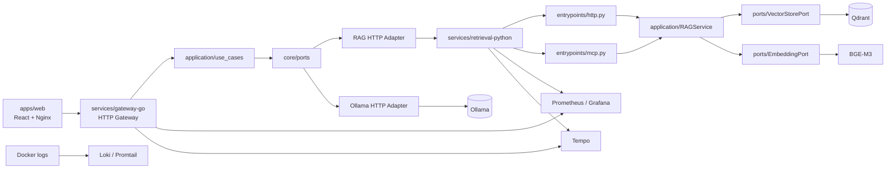

# Validación Final de Arquitectura

Fecha de revisión: 2026-09-22

## Resultado ejecutivo

El sistema tiene una arquitectura hexagonal/Clean razonable para un despliegue controlado. La solución compila y sus principales artefactos se validaron. No debe exponerse directamente a Internet hasta cerrar los bloqueos de seguridad y operación indicados en este documento y en [production-readiness.md](../operations/production-readiness.md).

## Arquitectura actualizada



### Gateway Go

```text
services/gateway-go/
├── cmd/api/                  Composition Root y lifecycle HTTP
├── internal/core/domain/     Entidades y errores de negocio
├── internal/core/ports/      Interfaces de entrada y salida
├── internal/application/
│   └── use_cases/            AuthService y QueryOrchestrator
└── internal/adapters/        HTTP, auth, clientes, resiliencia y observabilidad
```

### Retrieval Python

```text
services/retrieval-python/
├── app/                      Wrappers compatibles de Docker
├── src/manual_rag/
│   ├── domain/               Modelos y contratos de dominio
│   ├── ports/                Interfaces de infraestructura
│   ├── application/         RAGService y evaluación
│   ├── adapters/             Qdrant, BGE y Ollama
│   ├── entrypoints/          FastAPI y MCP
│   ├── bootstrap.py          Composición lazy y caché
│   └── observability.py      Métricas y logging
├── scripts/                  OCR, indexación y evaluación
└── tests/                    Pruebas unitarias
```

## Evaluación arquitectónica

### Hexagonal y Clean Architecture

**Resultado: adecuado, con deuda moderada.**

- El dominio y los puertos no dependen de HTTP, Qdrant, Ollama o frameworks.
- Los casos de uso Go están separados de los adaptadores.
- `RAGService` depende de puertos y es compartido por FastAPI y MCP.
- `bootstrap.py` concentra la composición concreta de adaptadores.
- Los entrypoints solo exponen transporte y delegan en aplicación.

Deuda restante:

- Los contratos HTTP Go/Python están duplicados manualmente.
- El repositorio de usuarios Go sigue siendo en memoria.
- Algunos errores HTTP se construyen directamente en handlers.
- El retry de Qdrant usa espera bloqueante y debe migrarse a una espera cancelable.

### SOLID

- **SRP:** handlers, casos de uso, adaptadores y observabilidad tienen responsabilidades diferenciadas.
- **OCP:** el worker pool y los puertos permiten cambiar adaptadores sin modificar casos de uso.
- **LSP:** las implementaciones de puertos se sustituyen en tests mediante fakes.
- **ISP:** los puertos están separados por capacidad: RAG, LLM, auth, embeddings y vector store.
- **DIP:** composición en `cmd/api` y `bootstrap.py`; el núcleo no instancia infraestructura.

## Componentes añadidos

- `internal/application/use_cases` en Go.
- `src/manual_rag` como paquete Python canónico.
- Entrypoints separados `entrypoints/http.py` y `entrypoints/mcp.py`.
- `bootstrap.py` con caché lazy de embeddings, Qdrant y `RAGService`.
- Healthchecks y readiness entre servicios.
- Graceful shutdown en Go y cierre OTLP en FastAPI.
- Timeouts externalizados.
- Retries limitados con backoff.
- Circuit breakers por dependencia en el gateway.
- Frontend multi-stage servido por Nginx no privilegiado.
- Informe operativo de preparación productiva.

## Observabilidad

Estado actual:

- Métricas HTTP, dependencias, readiness, generación, tokens, worker pool y rate limiting.
- Logs JSON en Go y Python.
- `traceparent` y exportación OTLP hacia Tempo.
- Prometheus, Grafana, Loki, Promtail y Tempo provisionados.
- Healthchecks de aplicación y persistencia de Qdrant.

Deuda:

- Faltan métricas de retries, circuitos abiertos, half-open y recuperaciones.
- Faltan alertas de memoria, CPU, reinicios y saturación con ventanas temporales.
- Promtail depende del Docker socket.
- La observabilidad está publicada sin una red administrativa separada.

## Seguridad

Controles presentes:

- Secretos JWT y credenciales de administración obligatorios en Compose.
- Contenedores de aplicación sin root.
- Nginx no privilegiado y headers básicos.
- Validación de colecciones y respuestas de error genéricas.
- No se usan tokens, prompts ni documentos como labels Prometheus.

Bloqueos antes de Internet:

1. Mover refresh tokens de `localStorage` a cookies `HttpOnly`, `Secure` y `SameSite`, con CSRF.
2. Configurar TLS y reverse proxy.
3. No publicar Qdrant, MCP ni observabilidad fuera de una red administrativa.
4. Añadir CSP, HSTS, `Permissions-Policy` y límites de body.
5. Fijar imágenes por digest y escanear imágenes/dependencias.

## Escalabilidad

Adecuado para una instancia pequeña gracias a worker pool, timeouts, cancelación, caché de modelos y circuit breakers locales.

Limitaciones:

- Rate limiting, sesiones y circuit breakers son locales por instancia.
- Qdrant y Ollama son puntos únicos de fallo en la topología actual.
- El almacenamiento de Qdrant y observabilidad es local.
- No existe todavía una estrategia de carga para generación y streaming concurrentes.

## Deuda técnica

- Contratos Go/Python sin pruebas contractuales OpenAPI/JSON Schema.
- Dependencias Python sin lockfile con hashes.
- Usuario en memoria y sin revocación de sesiones.
- Healthcheck MCP basado en TCP.
- Falta de pruebas de carga y restauración de backups.
- Falta de `govulncheck` en CI.
- README y comandos locales deben mantenerse alineados con `.env` y `--env-file`.

## Roadmap recomendado

### P0: exposición segura

- Reverse proxy, TLS y redes internas.
- Secretos gestionados fuera de Git y rotación.
- Escaneo de imágenes y dependencias.

### P1: sesión y contratos

- Cookies seguras, rotación/revocación y CSRF.
- OpenAPI y pruebas contractuales Go-Python.
- Errores HTTP centralizados y límites de request body.

### P2: operación

- Métricas de resiliencia y alertas con ventanas temporales.
- Backups/restauración de Qdrant y observabilidad.
- Smoke tests automatizados de readiness, búsqueda, gateway, SSE y MCP.

### P3: escala

- Rate limiting distribuido.
- Usuarios/sesiones persistentes.
- Qdrant replicado y pool de Ollama.
- Pruebas de carga y colas para operaciones pesadas.

## Validación final registrada

- `docker compose --env-file .env.example config --quiet`: correcto.
- `go test -count=1 ./...`: correcto.
- `go build -a ./...`: correcto.
- `python -m compileall src app scripts tests`: correcto.
- `npm run build` en `apps/web`: correcto.
- `npm audit --omit=dev --audit-level=high`: 0 vulnerabilidades high/critical.
- `govulncheck`: no instalado; queda como tarea de CI.
- Build completo de imágenes Python: pendiente de completar en un entorno con tiempo suficiente para descargar PyTorch CPU.

## Conclusión

La arquitectura interna está lista para continuar con un despliegue controlado interno. La promoción a Internet queda bloqueada hasta cerrar P0 y P1, especialmente red/TLS, gestión de tokens, escaneo reproducible y backups restaurables.
