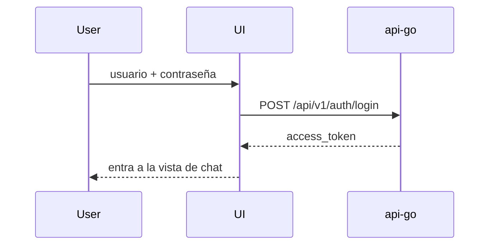
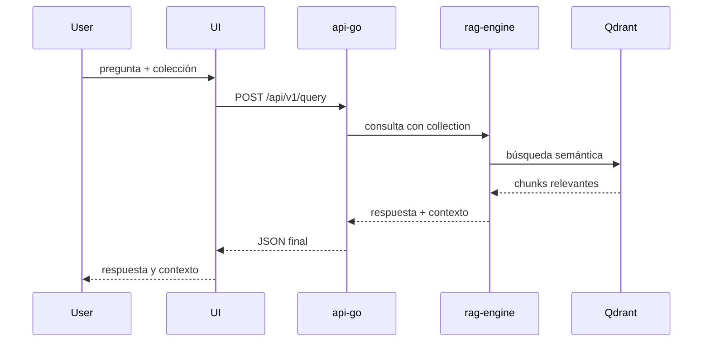
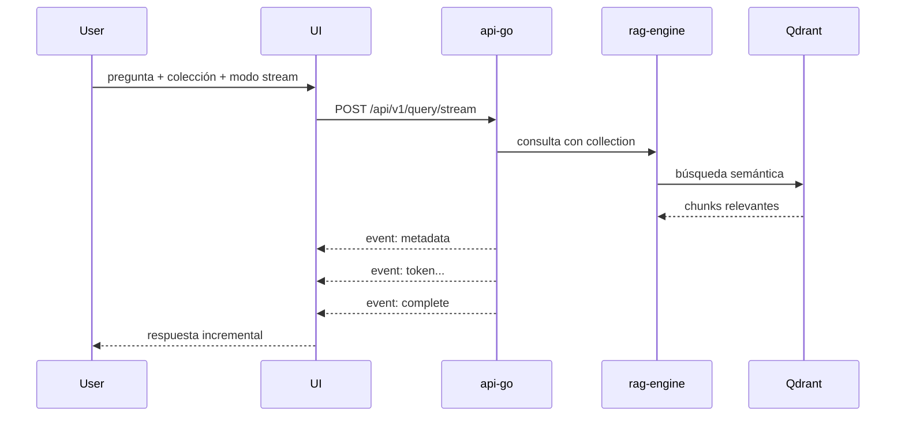

# 07 - Panel administrativo y gestión avanzada

El MVP de consulta web ya está implementado en `apps/web/`. Esta feature cubre su evolución hacia un panel administrativo operativo.

## Prioridad

P3 - media.

## Objetivo

Ampliar la UI existente para revisar consultas, contexto, métricas y estado operativo, además de gestionar usuarios y permisos sin depender de cURL.

## Problema actual

El sistema tiene una API funcional, pero carece de una interfaz directa para usuarios no técnicos y para operaciones del equipo interno.

## Alcance del MVP

Este MVP prioriza la experiencia mínima útil para validar el flujo completo de autenticación y consulta:

- Login real usando la autenticación del Gateway Go.
- Selector de colección antes de consultar.
- Selector para elegir entre consulta normal y streaming.
- Cuadro de chat para enviar preguntas al sistema.
- Visualización de la respuesta generada y del contexto recuperado.
- Sin historial persistente.
- Sin panel administrativo avanzado.
- Sin gestión de roles en UI.

## Requisitos del MVP

### 1. Login

- La pantalla de login debe llamar a `POST /api/v1/auth/login` del gateway Go.
- El MVP actual puede conservar el `access_token` en sesión para uso interno; antes de producción, el refresh token debe migrarse a una cookie `HttpOnly`, `Secure` y `SameSite` con protección CSRF.
- Si la autenticación falla, debe mostrar un mensaje claro.

### 2. Selector de colección

- Debe ofrecer al menos las colecciones disponibles en el proyecto:
  - `generic_manuals`
  - `manuales_tecnicos`
- La colección elegida se envía en el body de la consulta para el Gateway.

### 3. Selector de modo de consulta

- `normal`: usa `POST /api/v1/query`
- `stream`: usa `POST /api/v1/query/stream`

### 4. Chat

- El usuario escribe una pregunta.
- El sistema la envía con el token y la colección seleccionada.
- La respuesta se muestra en pantalla.
- En modo stream, los tokens se renderizan en tiempo real.

### 5. Contexto recuperado

- La UI debe mostrar el contexto recuperado por la consulta cuando exista.
- En modo stream se recibe a través del evento `metadata`.
- En modo normal el contexto viene dentro del JSON de respuesta.

## Flujo funcional

### Login



### Consulta normal



### Consulta con stream



## Estructura de la interfaz

### Pantalla 1: Login

- Título: Manual-RAG
- Campos:
  - usuario
  - contraseña
- Botón: Iniciar sesión

### Pantalla 2: Chat

- Cabecera con:
  - selector de colección
  - selector de modo (`sin stream` / `con stream`)
  - botón de logout
- Área de mensajes con conversación
- Caja de texto para nueva pregunta
- Botón enviar
- Panel lateral para mostrar contexto recuperado

## Diseño de componentes recomendados

- `LoginForm`
- `TopBar`
- `CollectionSelector`
- `QueryModeSelector`
- `ChatShell`
- `ChatMessage`
- `ChatInput`
- `ContextPanel`

## API a consumir

### Login

```http
POST /api/v1/auth/login
Content-Type: application/json

{"username":"admin","password":"tu-password"}
```

### Consulta normal

```http
POST /api/v1/query
Authorization: Bearer <access_token>
Content-Type: application/json

{
  "question": "¿Cómo se realiza el mantenimiento del sistema de lubricación?",
  "collection": "manuales_tecnicos"
}
```

### Consulta stream

```http
POST /api/v1/query/stream
Authorization: Bearer <access_token>
Content-Type: application/json

{
  "question": "¿Cómo se realiza el mantenimiento del sistema de lubricación?",
  "collection": "manuales_tecnicos"
}
```

## Criterio de finalización del MVP

- El usuario puede autenticarse con el gateway Go.
- Puede elegir la colección y el tipo de consulta.
- Puede hacer preguntas desde una UI mínima.
- Puede ver la respuesta generada.
- Puede ver el contexto recuperado.
- El sistema queda operable para pruebas rápidas y validación funcional.

## Fuera de alcance del MVP

- historial persistente de consultas
- panel de administración operativo
- métricas visuales
- gestión avanzada de usuarios o permisos
- dashboard de salud de servicios

## Recomendación de implementación

Implementar la UI como una app React con Vite, desacoplada del backend, usando llamadas HTTP directas al gateway y manteniendo la lógica de autenticación y chat separada por capas.

## Estado actual de implementación

Se ha dejado la base del MVP en una app frontend React + Vite con:

- login real contra `api-go`
- selector de colección y selector de modo stream/no stream
- chat principal con respuesta y contexto
- Dockerfile para arrancar la UI en contenedor
- integración en `docker-compose.yml` como servicio `frontend`