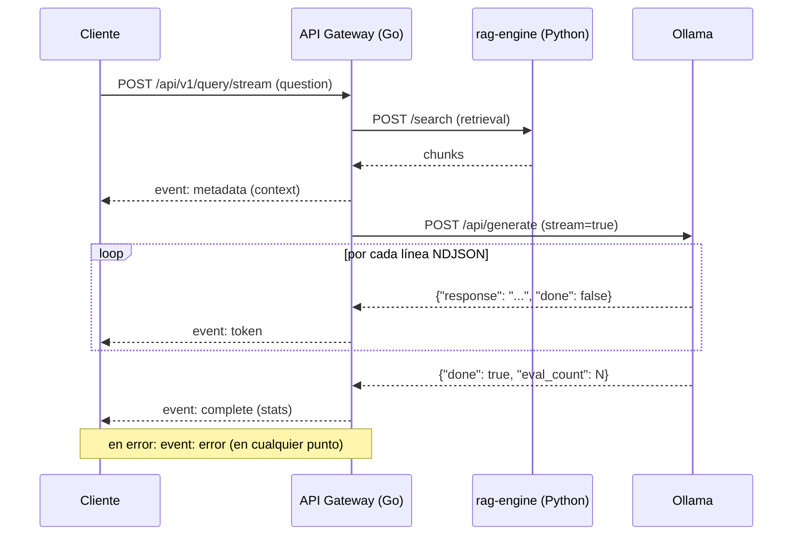

# 🚀 Go API Gateway — RAG System

Un API Gateway resiliente y concurrente desarrollado en **Go**, diseñado bajo los principios de **Clean Architecture** y **SOLID**. Actúa como el punto de entrada orquestador entre los clientes externos, el motor de búsqueda vectorial (`rag-engine` en Python) y el LLM (`Ollama`).

---

## 🏗️ Arquitectura y Diseño

El proyecto sigue una arquitectura hexagonal o **Clean Architecture** dividida en capas concéntricas, garantizando la inversión de dependencias y el desacoplamiento total de frameworks o infraestructura externa.

```text
services/gateway-go/
├── cmd/
│   └── api/
│       └── main.go                  # Composition Root & Inyección de Dependencias
└── internal/
    ├── core/                        # NÚCLEO DEL NEGOCIO (Sin dependencias externas)
    │   ├── domain/                  # Entidades puras y errores de negocio
    │   │   └── query.go
    │   ├── ports/                   # Contratos / Interfaces (DIP)
    │   │   ├── rag_port.go
    │   │   ├── llm_port.go
    │   │   └── query_service.go
    ├── application/
    │   └── use_cases/               # Casos de uso / Orquestación
    │       └── query_orchestrator.go
    └── adapters/                    # INFRAESTRUCTURA Y DETALLES
        ├── http/                    # Enrutamiento, Handlers y Middlewares
        │   ├── handlers/
        │   ├── middlewares/
        │   └── router.go
        ├── clients/                 # Adaptadores de salida (Python / Ollama)
        └── decorators/              # Decoradores para concurrencia (Worker Pool)
```

---

## 🧩 Principios SOLID y Patrones Aplicados

- **Single Responsibility Principle (SRP):** Cada paquete tiene una responsabilidad acotada. `QueryHandler` gestiona el protocolo HTTP, `WorkerPoolUseCaseDecorator` maneja los límites de recursos y `QueryOrchestrator` contiene la lógica de negocio y orquestación dentro de `internal/application/use_cases`.
- **Dependency Inversion Principle (DIP):** El núcleo (`core`) no depende de implementaciones concretas; define contratos en `ports/` que son implementados por la capa `adapters/`.
- **Open/Closed Principle (OCP) y Patrón Decorator:** La limitación de concurrencia se implementa envolviendo el caso de uso principal mediante `WorkerPoolUseCaseDecorator`, sin modificar el código del orquestador.
- **Graceful Degradation & Protection:** Diseñado para ejecutarse de forma segura en entornos con recursos limitados de CPU y memoria.

---

## ⚡ Concurrencia y Control de Recursos

- **Worker Pool (Semáforo mediante canales):** Limita las peticiones concurrentes utilizando un canal con búfer para evitar sobrecargas de RAM y CPU causadas por consultas simultáneas hacia Ollama.
- **Rate limiting por IP y usuario:** Aplica límites independientes por ventana fija en `POST /api/v1/query` y `POST /api/v1/query/stream`. Si se supera, responde `429 Too Many Requests`.
  - Configuración: `RATE_LIMIT_ENABLED` (default `true`), `RATE_LIMIT_REQUESTS` (default `60`), `RATE_LIMIT_WINDOW` (default `1m`).
- **Context Cancellation & Timeout Middleware:** Toda petición HTTP propaga un `context.Context` con un límite configurable de **5 minutos** por defecto. Si el cliente cancela o expira el tiempo, los sockets se cierran inmediatamente y se evitan goroutine leaks.
- **Reutilización de HTTP Client:** Instancia única de `http.Client` con soporte para Keep-Alive y reutilización de conexiones TCP.

---

## 🔐 Autenticación y Autorización

El API Gateway centraliza la autenticación de usuarios (`rag-engine` no recibe ni valida credenciales).

### Variables de entorno requeridas

| Variable | Descripción |
|---|---|
| `AUTH_JWT_SECRET` | Secreto HS256 del access token (mínimo 32 caracteres) |
| `AUTH_REFRESH_SECRET` | Secreto HS256 para refresh tokens (mínimo 32 caracteres) |
| `AUTH_ADMIN_USERNAME` | Usuario inicial configurado en el gateway |
| `AUTH_ADMIN_PASSWORD_HASH` | Hash bcrypt del password del usuario inicial |
| `AUTH_ADMIN_ROLES` | Roles separados por coma: `admin`, `operator`, `user` |

> **Opcionales:** `AUTH_ISSUER`, `AUTH_AUDIENCE`, `AUTH_ACCESS_TTL` (`15m`), `AUTH_REFRESH_TTL` (`168h`), `OLLAMA_MODEL`, `WORKER_LIMIT`, `RATE_LIMIT_ENABLED`, `RATE_LIMIT_REQUESTS`, `RATE_LIMIT_WINDOW`, `HTTP_CLIENT_TIMEOUT`, `REQUEST_TIMEOUT` (`5m`), `READINESS_INTERVAL` (`15s`).

---

## 🔌 Endpoints de la API

### Autenticación

#### Login
```http
POST /api/v1/auth/login
Content-Type: application/json

{"username":"admin","password":"tu-password"}
```

#### Refresh Token
```http
POST /api/v1/auth/refresh
Content-Type: application/json

{"refresh_token":"..."}
```

---

### Consultas RAG

#### POST `/api/v1/query` (Consulta Normal)

Procesa la pregunta, recupera contexto desde `rag-engine` y genera respuesta con Ollama. Requiere `Authorization: Bearer <access_token>`.

**Request:**
```json
{
  "question": "¿Cómo se realiza el mantenimiento del sistema de lubricación?",
  "collection": "manuales_tecnicos",
  "document_id": "0-lubricacion-mantenimiento",
  "chapter": "2",
  "section": "2.1"
}
```
*(Los campos `collection`, `document_id`, `chapter` y `section` son opcionales).*

**Response (200 OK):**
```json
{
  "question": "¿Cómo se realiza el mantenimiento del sistema de lubricación?",
  "answer": "El mantenimiento requiere revisar los niveles de aceite...",
  "context": [
    {
      "text": "Fragmento de texto recuperado del manual...",
      "score": 0.89,
      "metadata": {}
    }
  ]
}
```

---

#### POST `/api/v1/query/stream` (Streaming SSE)

Reenvía la respuesta token por token vía **Server-Sent Events (SSE)**. Requiere `Authorization: Bearer <access_token>`.



##### Eventos SSE (`Content-Type: text/event-stream`)

| Evento | Momento | Payload |
|---|---|---|
| `metadata` | Tras retrieval, antes de generar | `{"context": [...]}` |
| `token` | Por cada fragmento recibido | `{"text": "fragmento"}` |
| `complete` | Al finalizar correctamente | `{"total_duration_ms": 1234, ...}` |
| `error` | En cualquier fallo | `{"error": "mensaje"}` |

##### Ejemplo de consumo con `curl`
```bash
curl -N --no-buffer -X POST http://localhost:8080/api/v1/query/stream \
  -H "Authorization: Bearer <access_token>" \
  -H "Content-Type: application/json" \
  -d '{"question": "¿Cómo se realiza el mantenimiento del sistema de lubricación?"}'
```

##### Ejemplo de consumo en JavaScript
```javascript
const response = await fetch("http://localhost:8080/api/v1/query/stream", {
  method: "POST",
  headers: {
    Authorization: `Bearer ${accessToken}`,
    "Content-Type": "application/json",
  },
  body: JSON.stringify({ question: "¿Cómo se realiza el mantenimiento...?" }),
});

const reader = response.body.getReader();
const decoder = new TextDecoder();
let buffer = "";

while (true) {
  const { value, done } = await reader.read();
  if (done) break;
  buffer += decoder.decode(value, { stream: true });

  let frame;
  while ((frame = buffer.indexOf("\n\n")) !== -1) {
    const rawEvent = buffer.slice(0, frame);
    buffer = buffer.slice(frame + 2);
    const [eventLine, dataLine] = rawEvent.split("\n");
    const eventType = eventLine.replace("event: ", "");
    const payload = JSON.parse(dataLine.replace("data: ", ""));
    console.log(eventType, payload);
  }
}
```

##### Detalles técnicos del Streaming:
- **Cancelación:** Si el cliente cancela la conexión (`AbortController.abort()`), `net/http` cancela el `context.Context` deteniendo el stream sin fugas.
- **Timeout:** `REQUEST_TIMEOUT` (`5m`) acota la duración máxima.
- **Backpressure:** Cada token se escribe y se hace *flush* inmediatamente a nivel TCP.
- **Errores:** Errores posteriores a la emisión del primer evento se transmiten como `event: error`.

---

### Monitoreo y Salud

- `GET /health` — Check básico de salud (`{"status": "UP"}`).
- `GET /ready` — Verifica disponibilidad de `rag-engine` y Ollama (devuelve `503` si falla alguno).
- `GET /metrics` — Métricas en formato Prometheus (`api_go_time_to_first_token_seconds`, `api_go_worker_pool_in_flight`, etc.).

---

## 📊 Observabilidad

El gateway genera logs JSON y trazas OpenTelemetry OTLP. El contexto W3C se propaga hacia `rag-engine` y Ollama. Más detalles en [`deploy/observability/README.md`](../deploy/observability/README.md).

---

## 🛠️ Compilación y Ejecución

### Ejecutar con Docker Compose
```bash
docker compose --env-file .env.local up -d --build api-go
```

### Ejecutar / Probar en Local
```bash
cd services/gateway-go

go mod tidy
go build -v ./...
go test ./...
```
